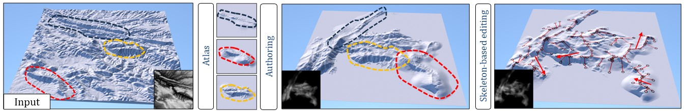

# Vector-based terrain modelling



This repository will contain the official code and resources for the paper *Vector-based terrain modelling*.

## Abstract

Vector-based graphics offer numerous advantages over grid-based models, including resolution independence and ease of manipulation.
Despite these benefits, their use in landscape modeling remains uncommon because of a lack of direct editing and interactive feedback, essential for matching the artist's vision. 
We introduce a new vector-based model for creating digital terrains based on computationally efficient primitives. We propose a method to convert grid-based digital elevation maps to this representation with a user-defined level of accuracy. 
Once vectorized, the terrain can be authored using interactive high-level skeleton-based tools adapted to the primitive representation, allowing local deformations that automatically adapt to underlying geomorphological structures and landforms of the terrain.

## Citation
If you find our work useful, please consider citing:

```
```

## License

This project is licensed under the MIT License. See the [LICENSE](LICENSE) file for details.
